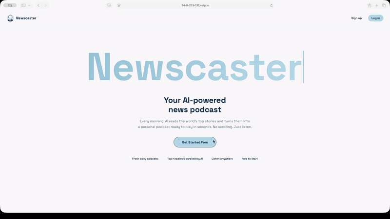
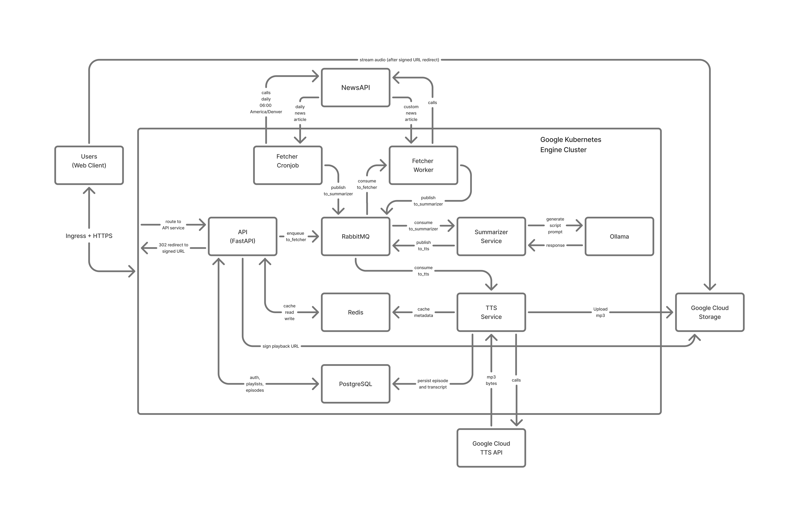

# Newscaster

Newscaster is a production-style, microservice-driven platform that turns live news into short podcast episodes.

It combines article retrieval, LLM summarization, text-to-speech generation, cloud storage, and a full web product experience (search, playlists, sharing, and authentication).

## Demo

Watch the full video demo here: [YouTube Demo](https://youtu.be/PrSQi9AIMDs)

[](https://youtu.be/PrSQi9AIMDs)

## Why this project

Following the news through social feeds is fast, but noisy. Newscaster was built to convert high-volume news into a structured listening experience that is easy to consume.

This project also serves as an end-to-end systems exercise: asynchronous workflows, cloud deployment, reliability hardening, and user-facing product design in one platform.

## Core capabilities

- Daily automatic podcast generation via Kubernetes CronJob
- Custom podcast episode generation on demand (keywords or genre)
- Search by query and date range
- Episode playback with transcript support
- Playlist creation, sharing, and management
- Google OAuth login
- Cloud-hosted audio persistence and retrieval

## System architecture



Request flow:

User request
-> FastAPI API
-> RabbitMQ queue
-> Fetcher service (NewsAPI)
-> Summarizer service (Ollama)
-> TTS service (Google Cloud TTS)
-> Google Cloud Storage + PostgreSQL + Redis
-> API serves episodes, playlists, and analytics

Service responsibilities:

- api: auth, frontend, search, playlists, analytics, orchestration
- fetcher: article ingestion and queue handoff
- summarizer: script generation using local LLM runtime
- tts: speech synthesis, object upload, and episode persistence
- postgres, redis, rabbitmq, ollama: data, caching, messaging, model runtime

## Notable engineering updates

- Migrated audio persistence to stable object references (gs://...) and now signs playback URLs at request time to avoid expired links for older episodes.
- Added startup migration retry logic to improve resilience during service/database startup races.
- Added health probes and resource limits/requests across Kubernetes workloads.
- Added API Horizontal Pod Autoscaler and enabled cluster/node autoscaling to reduce idle cost.
- Enabled HTTPS ingress with managed certificate for OAuth-compatible public access.

## Tech stack

- Backend: FastAPI, Python
- Messaging: RabbitMQ
- Data: PostgreSQL, Redis
- LLM summarization: Ollama
- TTS and object storage: Google Cloud Text-to-Speech, Google Cloud Storage
- Containers and orchestration: Docker, Kubernetes (GKE)
- Observability manifests: Prometheus, Grafana

## Run locally (Docker)

1. Copy newscaster/.env_example to newscaster/.env
2. Fill environment values (NewsAPI, DB, JWT, OAuth)
3. Add Google service account key at newscaster/secrets/gcp-key.json
4. From the newscaster directory, run:

```bash
docker compose up --build
```

5. Open http://localhost:8000

## Future improvements

- Move secrets to a managed secret solution (for example, Secret Manager integration)
- Use separate node pools for stateful services and elastic workers for stronger isolation and cost efficiency
- Add queue retry backoff and dead-letter handling for failed jobs
- Expand integration and end-to-end pipeline tests
- Add a stable custom domain for public demo sharing
